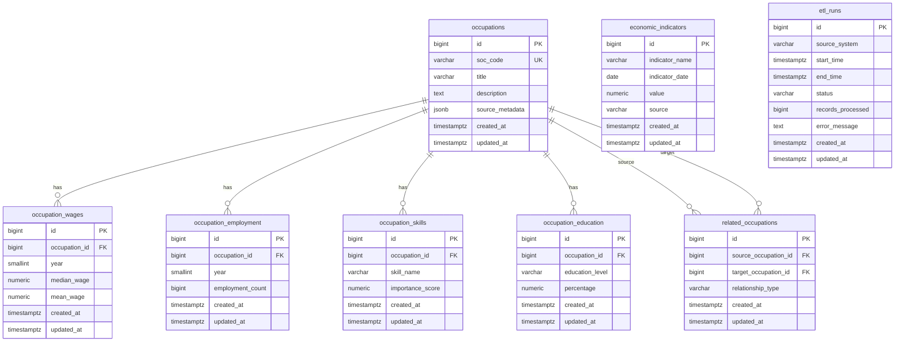

# LaborIQ Database Schema

This document describes the initial PostgreSQL schema created by Flyway migration `V1__create_laboriq_schema.sql`.

## ERD

## Table Notes

`occupations` stores the canonical occupation record keyed by unique SOC code. `source_metadata` is JSONB so ETL jobs can retain source dataset identifiers, release versions, URLs, and other provenance fields without changing the core schema.

`occupation_wages`, `occupation_employment`, `occupation_skills`, and `occupation_education` are occupation detail tables with cascade deletes from `occupations`. Wage and employment rows are unique by occupation and year. Skill and education rows are unique by occupation and name or level.

`related_occupations` models directed occupation relationships. The schema prevents self-relationships and duplicate source-target-type combinations.

`economic_indicators` stores date-based labor and macroeconomic measurements. Rows are unique by indicator name, date, and source.

`etl_runs` records ingestion activity by source system, timing, status, record count, and error details.

## Index Summary

The migration adds indexes for common lookup and join paths:

- SOC code uniqueness on `occupations`.
- Foreign-key indexes on all occupation detail tables.
- Year indexes on wage and employment fact tables.
- Lookup indexes for skill name, education level, relationship type, economic indicator name/date/source, and ETL status/start time.
- A GIN index on `occupations.source_metadata` for JSONB metadata queries.
